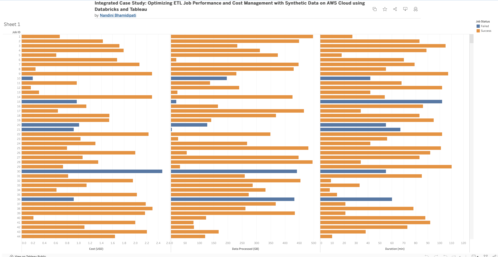

# Integrated Case Study of ETL Job Performance

## Context and Objectives

For Data Operations Managers at utility companies, a major focus has been on managing FinOps and optimizing ETL job performance on AWS Cloud using Databricks. To manage cost and operational efficiency, I developed synthetic data to simulate job execution.

The synthetic data was modeled after SAP and GIS data. It included the following metrics crucial for operational analysis:

- **Duration**: Total time taken for the job to complete (in minutes)
- **Data Processed**: Volume of data processed by the job (in GB)
- **Job Status**: Outcome of the job (e.g., Success, Failed)
- **Cost**: Total cost of executing the ETL job (in USD)v
- **Job ID**: Unique identifier for each ETL job

You can find the data in the `ETL_Job_Performance_and_Costs.csv` file. The code I used to generate this data is in the `kpi-dashboard-1.ipynb` file.

## Implementation and Analysis with Tableau

Using the synthesized data, [I built a Tableau dashboard for visualization.](https://public.tableau.com/views/IntegratedCaseStudyOptimizingETLJobPerformanceandCostManagementwithSyntheticDataonAWSCloudusingDatabricksandTableau/Sheet1?:language=en-US&:sid=&:display_count=n&:origin=viz_share_link). It encompassed three bar charts corresponding to the key metrics- Cost, Data Processed, and Duration. Each ETL job was represented with a unique ID, and the job status was marked with color coding: orange for success and blue for failure.

## Interpretation of Data

- **Cost Insights**: Failed jobs contributed to the overall costs, indicating opportunities for cost savings through optimization and improved error handling.
- **Data Volume Considerations**: Both small and large volumes of data Ire present in failed jobs, suggesting the need for management of different data sizes.
- **Duration Distribution**: A wide variation in the duration of successful jobs indicated benchmarks for performance, and the varied durations of failed jobs indicated areas for process improvement.

## Solutions

### Cost Optimization and Error Handling

#### Solution 1: Proactive Error Monitoring and Alerting
- Develop a real-time error monitoring and alerting system.
- Integrate with incident management tools for triaging and resolution.
- Error analysis to identify root causes and improve error handling.

#### Solution 2: Cost Tracking and Optimization Strategies
- Develop a cost tracking mechanism to monitor and analyze the costs of failed jobs.
- Implement auto-scaling of resources and AWS spot instances/EC2 for workloads.
- Explore serverless or managed services for specific workloads.

### Data Volume Management

#### Solution 3: Parallel Processing & Partitioning Strategies
- Implement parallel processing techniques for large data volumes (Spark).
- Explore data partitioning and incremental processing strategies to handle large datasets.

#### Solution 4: Data Lifecycle Management
- Develop a data lifecycle management strategy to archive or purge unnecessary data.
- Implement data compression techniques to reduce TCO.
- Explore data tiering strategies to store frequently accessed data in RAM and less frequently accessed data on cheaper storage (AWS S3 bucket).

### Performance Optimization and Anomaly Detection

#### Solution 5: Performance Monitoring and Benchmarking
- Performance monitoring/benchmarking system to track job durations and bottlenecks.
- Analyze job durations for performance baselines and identification of anomalies.
- Implement performance tuning techniques, such as optimizing SQL queries, adjusting resource configurations, and leveraging caching mechanisms.

## Impact and Insights for Enterprise Decision-Making

**IT leadership**:
- Cost of investment (how much is this going to cost to implement)
- Personnel Resources (how long will this take/when can this start)

**Financial analysts**:
- Cost of maintenance (daily, Iekly, monthly, quarterly, yearly)
- Long Term financial impact (how much is going to be saved vs. cost of doing nothing)

**Operational teams**:
- Feasibility (Is this doable?)
- Architecture/Infrastructure (diagrams)
- Technology requirements (what is needed to successfully build/integrate)

## Concluding Impact

The problem I set out to solve in this document is data operations cost management. I generated synthetic data to simulate ETL jobs for GIS and SAP data. I built a dashboard through Tableau to visualize key metrics- Cost, Data Processed, and Duration.

The insights I derived Ire:
- **Cost**: Failed jobs contributed to the overall costs,
- **Data Processed**: Better management is needed of different data sizes,
- **Duration**: There was variation in duration of failed jobs.

The proposed solutions are:
- **Cost**: Proactive Error Monitoring and Alerting
- **Data Processed**: Parallel Processing & Partitioning Strategies
- **Duration**: Performance Monitoring and Benchmarking
